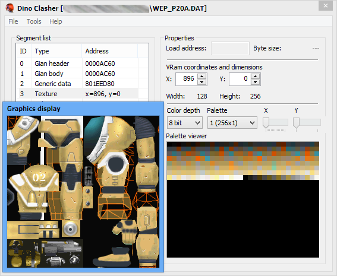

A generic extractor for Dino Crisis 1 & 2. It currently supports only the PlayStation builds of the game, even if it can apparently read PC files without crashing (still, no graphics or any other type of displaying capability). Support for other ports might be implemented with the following updates.

